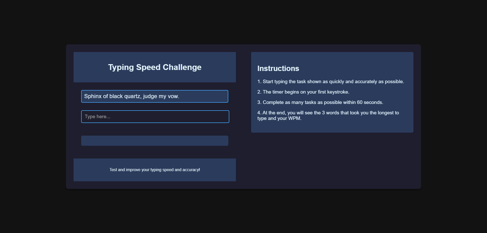
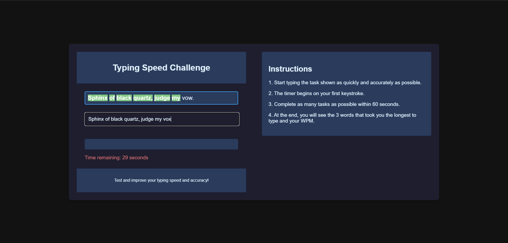
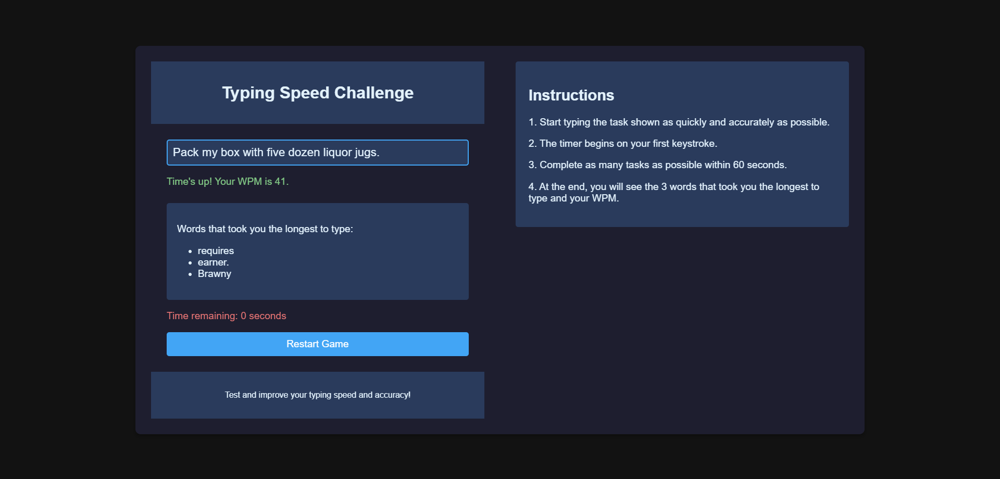

# Typing Speed Challenge 🚀

A dynamic and engaging **Typing Speed Challenge** application designed to help you test and enhance your typing speed and accuracy. Users are presented with randomised sentences, and their performance is measured with detailed analytics at the end of each session.

---

## 🎯 Features

- **Real-Time Typing Speed Tracking**: Monitor your progress and performance live as you type.
- **Time-Based Challenges**: Push yourself to complete as many sentences as possible within 60 seconds.
- **Insightful Analytics**: Get your Words Per Minute (WPM) score and a breakdown of the three words that took the longest to type.
- **Randomised Sentences**: Unique tasks are generated every session to keep the challenge fresh and exciting.

---

## 🖼️ Screenshots

### 1. **Home Screen**


### 2. **Typing in Progress**


### 3. **Results and Analytics**


---

## 💻 Technologies Used

- **Frontend**: HTML, CSS, JavaScript
- **Backend**: Python (Flask Framework)
- **Model Serialisation**: Joblib
- **Data Management**: JSON for delivering randomised sentences

---

## 📂 Project Structure

```
.
├── app.py               # Main Flask application
│
├── templates/
│   └── index.html       # HTML structure for the web app
│
├── static/
│   ├── style.css        # Styling for the user interface
│
├── difficulty_model.pkl # Pre-trained model for task difficulty (placeholder)
│
├── assets/
│   ├── Project_example1.PNG
│   ├── Project_example2.PNG
│   ├── Project_example3.PNG
└──
```

---

## 🚀 Getting Started

### Prerequisites
1. Python 3.7 or higher
2. Flask installed
3. Joblib library installed

### Installation

1. Clone this repository:
   ```bash
   git clone https://github.com/your-username/typing-speed-challenge.git
   cd typing-speed-challenge
   ```

2. Install the required dependencies:
   ```bash
   pip install flask joblib
   ```

3. Start the Flask application:
   ```bash
   python app.py
   ```

4. Open your browser and navigate to:
   ```
   http://127.0.0.1:5000/
   ```

---

## 🤔 How to Use

1. Start typing the displayed sentence in the task box.
2. The timer begins as soon as you press your first key.
3. Aim to complete as many tasks as possible within the 60-second timer.
4. Once the time is up, review your WPM and the detailed analytics of your performance.

--- 
